# Healthcare Policy Compliance - Project Requiremnt Analysis and Design

## Front-End Interface

# Admin Dashboard Page

This is the main page of admin dashboard. After logging, the admin can see all the information for the corresponding tab. Right now, admin cannot perform any write or update operation. The main objective of this page to show all users' information.

Admin dasgboard has five tabs:

- Patients
- Emergency Contacts
- Providers
- Insurance Agents
- Pharmacists

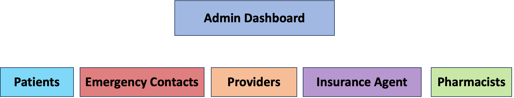

### 1. Patients Dashboard Page

This page shows all the patients information. It is also read only mode, there is no write or upddate operation here.

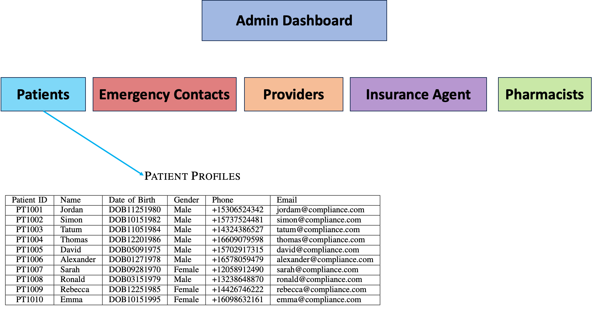

### 2. Emergency Contacts Dashboard Page

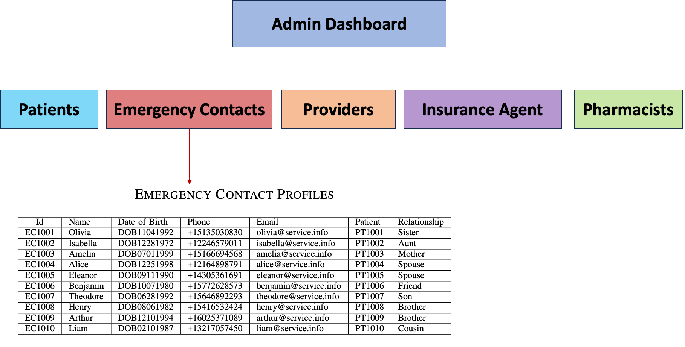

### 3. Providers Dashboard Page

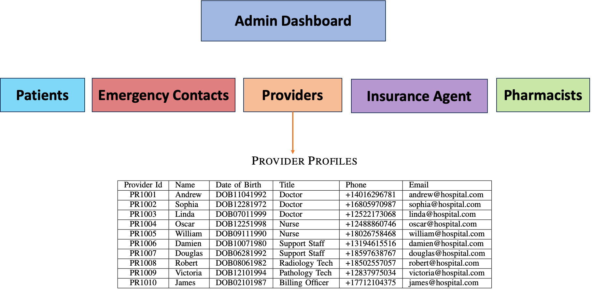

### 4. Insurance Agents Dashboard Page

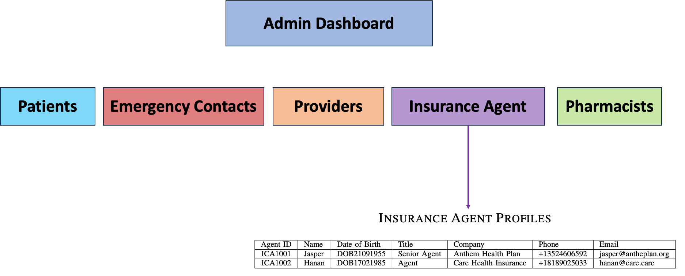

### 5. Pharmacists Dashboard Page

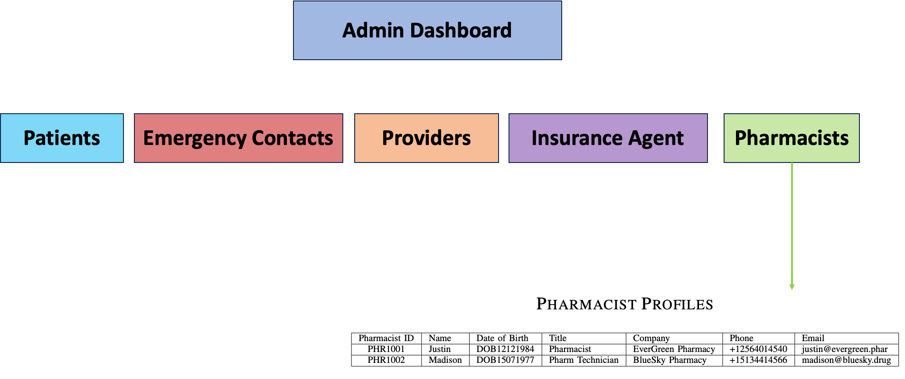

# Patient Profile Page

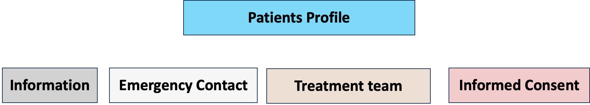

# Emergency Contact Profile Page

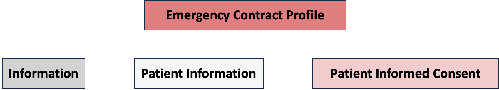

# Provider Profile Page

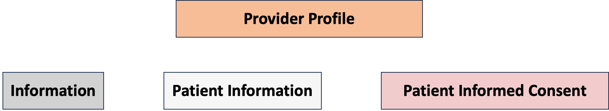

# Insurance Agent Profile Page

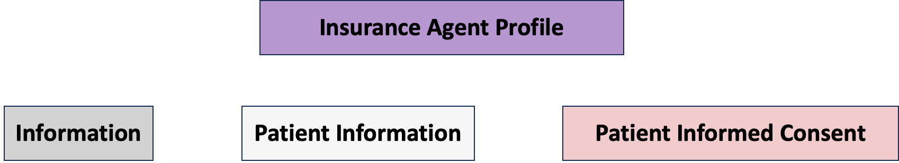

# Pharmacist Profile Page

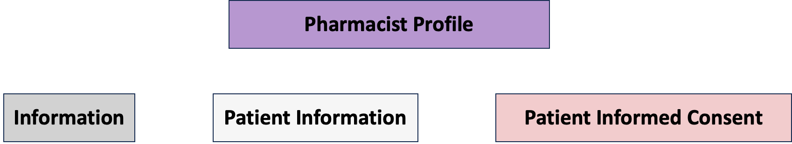
